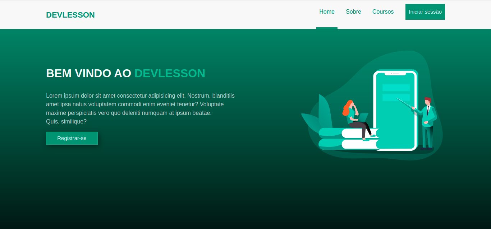
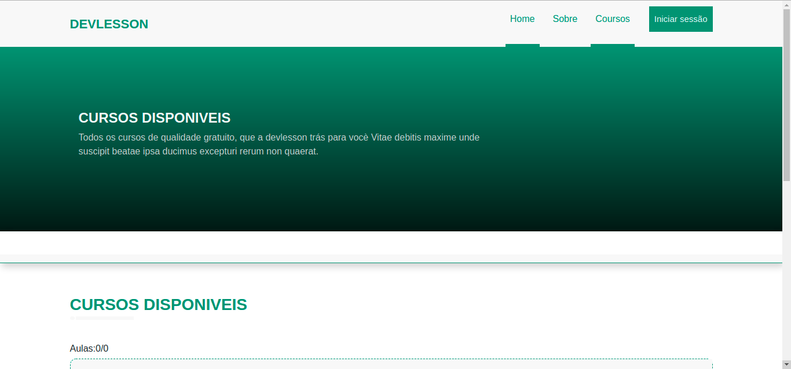

# DEVLESSON 

É um projecto feito para teste dada Pela Empresa Verzel, com Objectivos de teste os meus conhecimentos ou experiência como desenvolvedor, nas seguintes linguagem: Python(Django) e React js.

### npm start
executar a aplicação

### VISUALIZAÇÃO DA APLICAÇÃO

Pagina inicial da aplicação: 

 

 Pagina responsavel por carregar os modulas e as aulas: 

 

### FUNCIONALIDADES DA APLICAÇÃO

Os recursos necessários da aplicação são:

- [x] Criação, remoção e atualização de usuário
- [x] Criação, remoção, atualização e deleção de módulo
- [x] Criação, remoção, atualização e deleção de aula
- [x] Authenticação de usuário
- [x] Validação dos campos antes da inserção
- [ ] Listagem das aulas em ordem alfabética
